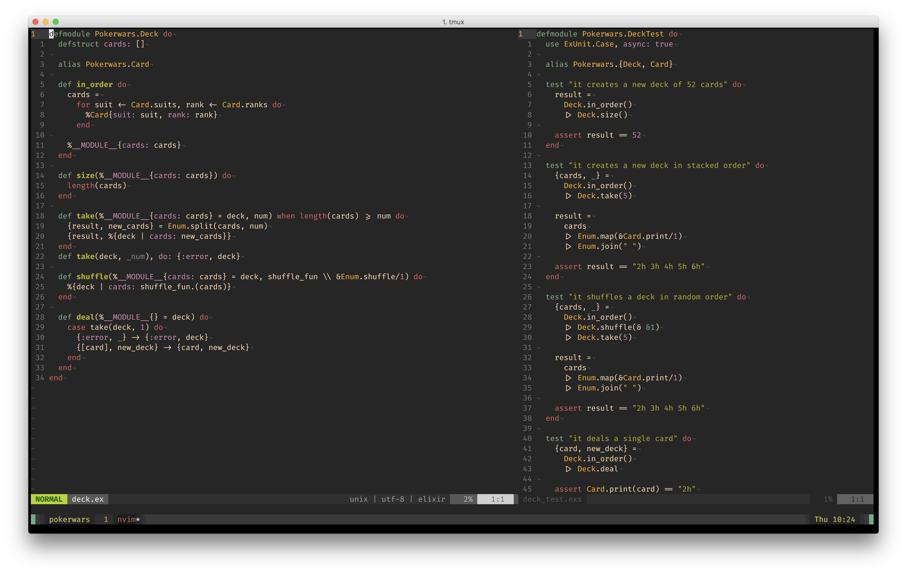

Arkham's vim configuration
==========================

My configuration uses [vim-plug](https://github.com/junegunn/vim-plug).
(But you don't need to care about any of that.)

## Preview

## Installation:

Prerequisites: ruby, git.

1. Move your existing configuration somewhere else:
   `mv ~/.vim* ~/.gvim* my_backup`
2. Clone this repo into ".vim":
   `git clone https://github.com/Arkham/vimfiles ~/.vim`
3. Go into ".vim" and run "rake":
   `cd ~/.vim && rake`

This will install a "~/.vimrc" symlink to the config inside the ".vim" directory.

## Features:

- Use vim-plug as plugin environment
- Sane defaults: nocompatible mode, utf8, advanced syntax highlighting
- 2 spaces, no tabs, uses bash-alike autocompletion for files and directories
- Tabs are displayed as `▸ `, end of lines as `¬`, trailing spaces as `.`
- Incremental, case-insensitive search
- Handful hard wrapping for text and markdown
- Follow style conventions for ruby, python and makefiles
- Reopen files in the same spot where you closed them
- 'Leader' character mapped to "," (comma)
- Pressing enter in normal mode resets search highlighting
- %% is expanded to the current directory in command mode
- `,e` edits a file in the same directory of the current
- `,f` opens file search via fzf plugin
- `,b` opens buffer search via fzf plugin
- `,m` opens mru files search via fzf plugin
- `,,` switches between two last buffers
- `,cf` jumps to the first conflict marker
- `,l` toggles list mode
- `,p` copies the path of the current file
- `,kw` or `:KillWhitespace` removes all trailing spaces
- `<C-j/k/h/l>` switches between windows (no need to prepend `<C-w>`)
- Cursor keys for movement disabled!
- Nice looking status line
- Awesome configurations for Ag, Nerdtree and more..
